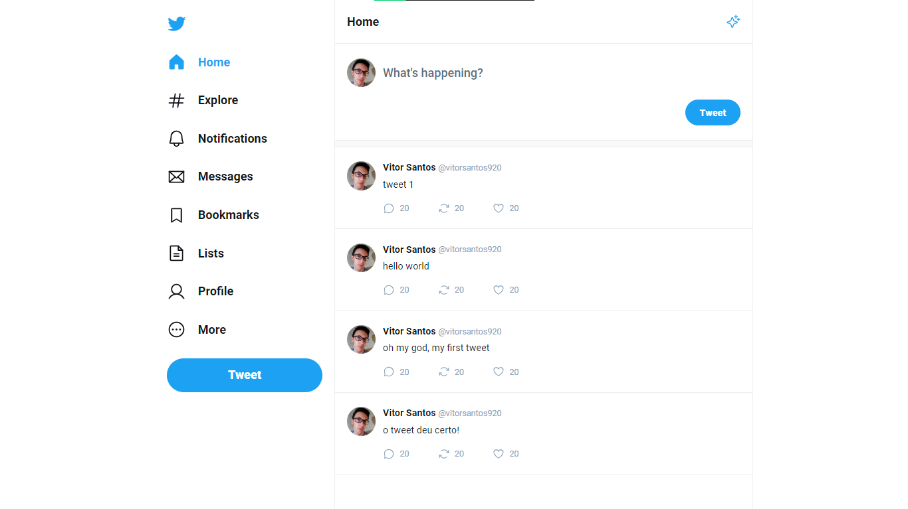
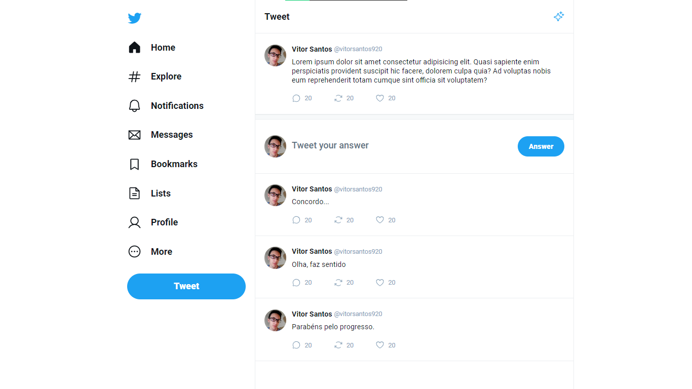

# UI Twitter

## ❓ Sobre

Réplica da Interface do Twitter feita na React Masterclass da Rocketseat, onde, em seu decorrer, foram abordados os conceitos iniciais e essencias da biblioteca ReactJS.

---

## ⭐ Conceitos e Tecnologias

- ReactJS;
- ViteJS;
- TypeScript;
- React Router DOM;
- GIT;
- Figma;

---

## 🖥 Visualização

---

---

<imagem-visualizacaoN>

    
 &copy; Vitor Santos

